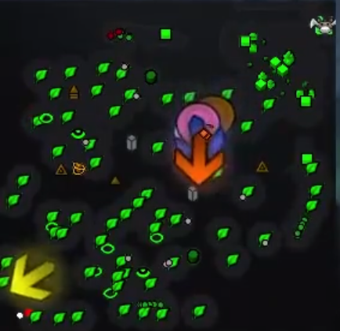

# Hey there, I'm Vitalik 👋

  
  

<table>
  <tr>
    <td width="30%" align="center" valign="middle">
      
    </td>
    <td width="70%" valign="top">
      <h3>👨‍💻 About Me</h3>
      <ul>
        <li>🎓 <b>Education:</b> Information Security student at <b>ITMO University</b> (1st year completed!).</li>
        <li>🎯 <b>Current Focus:</b> Leveling up practical skills, solving <b>Hack The Box</b> machines, and building security tools.</li>
        <li>🎮 <b>Interests:</b> Cybersecurity and supporting the team as Treant Protector in Dota 2.</li>
      </ul>
    </td>
  </tr>
</table>

### 🧰 Skills & Tools

 
 
 
 

